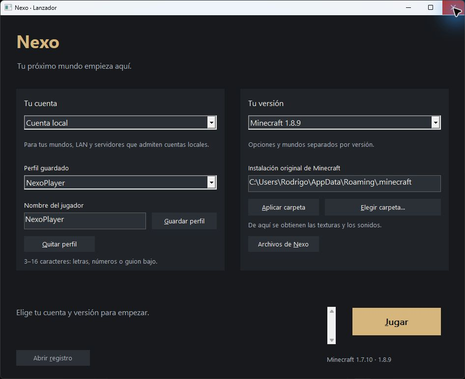
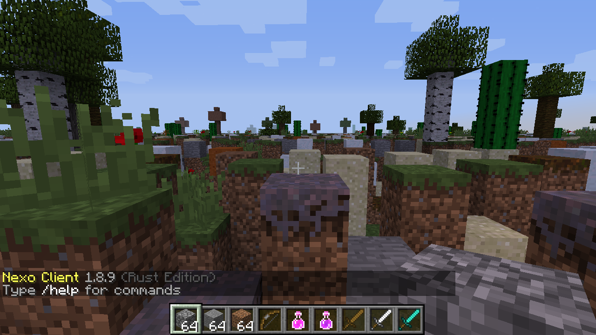
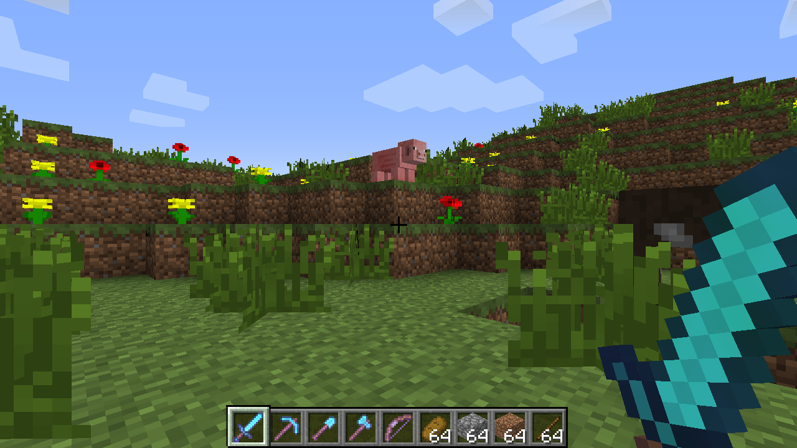

# Nexo Client

Nexo Client is an independent project under development: a launcher and Rust/Vulkan clients for Minecraft Java Edition **1.7.10 and 1.8.9**.

## Project goals and development status

The project aims to reproduce the behavior of these versions while improving performance. Development is ongoing; complete compatibility or migration is not claimed.

## Authentication and Minecraft Services access

Nexo Client requires authentication through **Microsoft OAuth, Xbox Live, XSTS, and Minecraft Services** to obtain the user's Minecraft profile and enable connections to online servers using the user's own account and Minecraft license.

The project uses its own application registered in **Microsoft Entra**. The authentication exchange with Minecraft Services currently returns **HTTP 403**. We are requesting approval of the application's ID for Minecraft Services access; the exact cause of the rejection has not yet been confirmed.

This public repository provides project information for that approval request.

## Development screenshots

These are real screenshots of development builds. Features and visuals are still being refined; the images do not claim complete compatibility or visual parity.

### Native Windows launcher

Version selection and launch controls in the Nexo launcher.

### Rust/Vulkan client — Minecraft Java Edition 1.8.9

Controlled development test scene showing terrain, vegetation, clouds, the HUD and a held block. Work in progress.

### Rust/Vulkan client — Minecraft Java Edition 1.7.10

Controlled development test scene showing a first-person sword, terrain, vegetation, a pig and clouds. Work in progress.

## Repository scope

This repository contains project presentation documentation and development screenshots only. It does not distribute client source code, executables, JAR files, Minecraft resources, credentials, or private configuration files.

## Affiliation

Nexo Client is not an official product and is not affiliated with Mojang or Microsoft.
